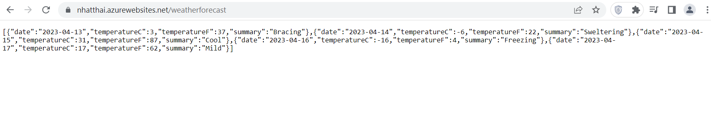

# NET7-WebAPI
Example Deployment NET7 Web API on Azure App Service via GitHub Actions
+ Using Code in Azure Service App(deployment-webapi.yml)
+ Using Container in Azure Service App(deployment-webapi-container.yml)

### Result
+ 
+ 
+ 